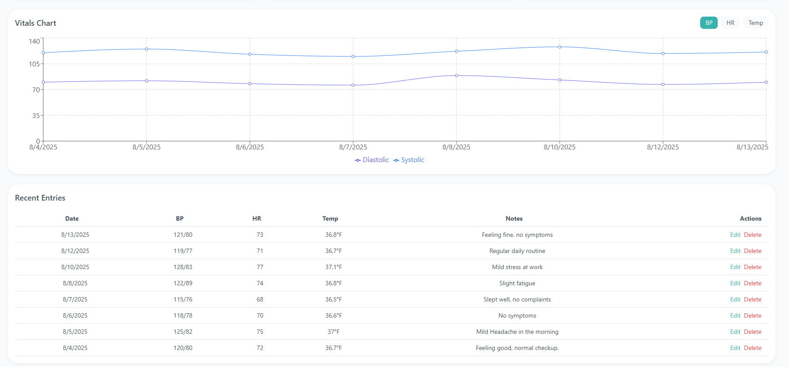
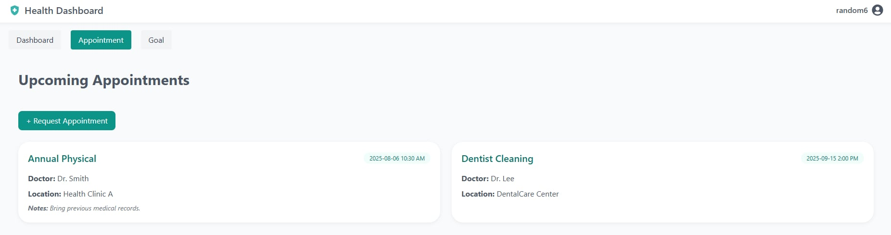

# 🚑 Healthcare Patient Dashboard

Author: My Lu  
Date: August 3, 2025

---
A modern web-based dashboard for tracking and visualizing patient vital signs, designed for healthcare professionals and individuals. The user-friendly interface makes it easy to record, edit, and review daily health metrics like blood pressure, heart rate, and temperature. Interactive charts and summary cards provide clear insights into health trends, supporting early detection of potential issues. Built for accessibility, the dashboard enables efficient data entry, secure storage, and real-time visualization for both clinics and personal use.
- Demo 
- Project Report
- [Live Website](https://healthcare-patient-dashboard.vercel.app)
---
## 📷 Demo Pic
- Could try this account to see the display:
    - Email : random6@gmail.com
    - Password : Password123

- Dashboard



- Appointment


- Goal


### Features
- Vital Summary : Quick overview of blood pressure, heart rate, temperature, and more
- Trends Analysis: Interactive charts to visualize health data over time
- Recent Entries Table : Easily review and manage recent health logs
- Add/ Edit Vitals : User-friendly forms for entering new vitals
- Authentication : Secure login & JWT-based API access
- FastAPI backend : RESTful API for all data operation
- PostgreSQL database : Reliable storage for all patient record


### 💻 Tech Stack
- **Frontend**: React, Vite, TailwindCSS  
- **Backend**: FastAPI, Python  
- **Database**: PostgreSQL  
- **Other**: JWT Auth, REST API

## 📃 Getting Started
Prerequisites:
- Node.js (v18+ recommended)
- Python (3.10 + recommended)
- PostgreSQL

1. Clone the repository
    ``` bash
    git clone https://github.com/MyLu004/Healthcare-Patient-Dashboard.git
    cd Healthcare-Patient-Dashboard
    ```

2. Backend Setup
    ``` bash 
    cd backend
    python -m venv venv
    source venv/bin/activate  # On Windows: venv\Scripts\activate
    pip install -r requirements.txt
    # Configure your .env file (see .env.example if available)
    uvicorn main:app --reload
    ```

3. Frontend Setup
    ``` bash
    cd ../frontend
    npm install
    # Set your VITE_API_URL in .env (see .env.example)
    npm run dev
    ```

4. Database
- Make sure PostgreSQL is running
- Updatee the datavase URl in your backed `.env` file
    - Set up .env in your backend
    ``` env
    # PostgreSQL Database Configuration
    POSTGRES_DB= your_database_name
    POSTGRES_USER=postgres
    POSTGRES_PASSWORD= your_password
    POSTGRES_HOST=localhost
    POSTGRES_PORT=5432
    DATABASE_URL=postgresql://{POSTGRES_USER}:{POSRGRES_PASSWORD}@{POSTGRES_HOST}:{POSTGRES_PORT}/{POSTGRES_DB}

    # JWT Settings
    JWT_SECRET_KEY={YOUR_KEY}
    JWT_ALGORITHM=HS256
    JWT_ACCESS_TOKEN_EXPIRE_MINUTES=30
    ```

---

### 📁 Project Structure

``` pgsql
Healthcare-Patient-Dashboard/
│
├── backend/
│   ├── app/
│   │   ├── __init__.py
│   │   ├── main.py
│   │   ├── models.py
│   │   ├── schemas.py
│   │   ├── database.py
│   │   ├── oauth2.py
│   │   ├── requirement.txt
│   │   ├── runtime.txt
│   │   ├── routers/
│   │   │   ├── __init__.py
│   │   │   ├── auth.py
|   │   │   ├── recent.py
|   │   │   ├── vitals.py
|   │   │   ├── trends.py
|   │   │   └── user.py
│   │   └── utils/
│   │       ├── __init__.py
│   │       └── hasing.py
│   ├── tests/
│   │   └── test_main.py
│   ├── .env
│   ├── requirements.txt
│   ├── alembic/                 # (optional, if using Alembic for migrations)
│   └── README.md
│
├── frontend/
│   ├── public/
│   │   └── index.html
│   ├── src/
│   │   ├── components/
│   │   │   ├── Dashboard/
│   │   │   ├── SummaryCards.jsx
│   │   │   ├── VitalsChart.jsx
│   │   │   ├── EntryTable.jsx
│   │   │   └── EditVitalModal.jsx
│   │   ├── pages/
│   │   │   ├── Home.jsx
│   │   │   └── Settings.jsx
│   │   ├── api.js
│   │   ├── App.jsx
│   │   ├── main.jsx
│   │   └── index.css
│   ├── .env.example
│   ├── package.json
│   ├── tailwind.config.js
│   ├── vite.config.js
│   └── README.md
│
├── .gitignore
├── README.md
└── LICENSE
```

## 🏥  HOW IT WORK : Application Workflow Summary

1. User Authentication  
    - User visits the web app and logs in with their credentials.
    - The frontend sends login info to the backend.
    - Backend verifies credentials and returns a JWT access token.
    - The token is used for all future API requests to ensure security.


2. Dashboard Overview
    - After login, the user lands on the dashboard.
    - The frontend fetches summary, trends, and recent vitals data from the backend using the access token.
    - Key components render:
        - SummaryCard: Shows the latest vital signs (BP, heart rate, temperature, etc).
        - VitalsChart: Plots health trends over time.
        - EntryTable: Lists recent health entries.

3. Adding New Vitals
    - User clicks “Add New Entry”.
    - The NewEntry form/modal appears.
    - User fills in their latest health measurements.
    - On submit, data is sent to the backend (POST /vitals).
    - Backend saves the entry in the database and returns the new record.
    - Frontend updates the dashboard to include the new entry.

4. Editing Existing Vitals
    - In the recent entries table, user selects “Edit” on an entry.
    - The EditVitalModal opens, pre-filled with entry data.
    - User modifies the values and submits.
    - Backend updates the entry in the database (PUT /vitals/{id}).
    - Frontend refreshes the dashboard and table to reflect changes.

5. Data Visualization and Tracking
    - The dashboard auto-updates summary cards, charts, and tables as new or edited data arrives.
    - Users get real-time insights into their health patterns and can track changes over time.

6. Security and Logout
- All API requests include the JWT token for authentication.
- User can log out at any time, which removes their token from local storage and returns them to the login page.

### 📙 Tech Flow Recap
- Frontend (React): Handles UI, user input, and API calls.
- Backend (FastAPI): Manages authentication, processes requests, validates data, and communicates with PostgreSQL.
- Database (PostgreSQL): Stores user accounts and all vitals entries securely.

## ✏️ Author
**My Lu**   
Intern @ Ontash  
Email: myluwork004@gmail.com  
LinkedIn : www.linkedin.com/in/my-lu   
Github : https://github.com/MyLu004  
